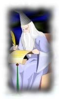
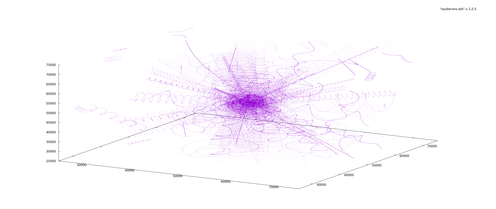

# zauberon ('sŏw-bă-ŏn)    
A C++ program to simulate the quantum physical characteristics of fundamental particles as 
described in the book 'New Age Quantum Physics' by Al Schneider, ISBN-10: 1467938009.  



In the book, fundamental particles are called photons.  For this simulation I've chosen the name 'Zauberon' to eliminate 
confusion with the established concept of a photon, and to pay homage to Al's prowess in the world of magicians.

## Model Concepts
This model of the universe postulates that it is composed **ONLY** of Zauberons that move within space in a single 
program manner, but with varying program parameters. Additionally, the program specifies a state called "collision", and 
specifies what happens to a set of Zauberons associated with a specific collision.

### Spacial Concepts
Space is quantized.  Zauberons can only be positioned at nodes within space's three-dimensional "grid".

## Movement Concepts
The Zauberon movement program description follows:
1. They travel in circular helical paths along a direction vector with either **right** or **left** rotation.
2. The speed of the projection on to their direction vector is constant, and equal to the speed of light.
3. Their mass is inversely proportional to their circular helical radius.
 
## Counter Concepts
Each Zauberon contains a counter that is decremented by one for each wavelength traveled, and incremented for each 
collision. 
 
## Collision Concepts
Zauberons are said to have collided whenever more than one are positioned at the same spacial node.  The following
describe the result of a collision:
1. If only two Zauberons collide:
  * The one with the highest counter reverses direction.
  * If they both have the same rotation the lower one's direction also reverses.
  * Both counters increment by one.
2. If more than two collide:
  * Create two groups, left and right rotation, and sum their counters.
  * Reverse the direction of the Zauberons in the group with the higher sum.
  * If the group sums are equal all directions reverse.
  * If there's only one group their directions reverse.
  * All counters increment by one.

## Plot Of Sample Data
Executing the following command:
```bash
./zauberon -i 1000 -z 100
```
results in a file named **zauberons.dat**.  When plotted with **gnuplot** using the following commands:
```bash
gnuplot
set yrange [25000:75000]
set ticslevel 0 
set xrange [25000:75000]
splot "zauberons.dat" u 1:2:3 with dots
```
the resulting plot looks like this:



Note that the plot will change each time the **zauberon** command is executed because it is generating random data
to define the path characteristics of the various zauberons it creates.

## License

Copyright © 2020 by Paul H. Whittington.  All rights reserved.

This program and the accompanying materials are made available under the
terms of the Eclipse Public License 2.0 which is available at
http://www.eclipse.org/legal/epl-2.0.

This Source Code may also be made available under the following Secondary
Licenses when the conditions for such availability set forth in the Eclipse
Public License, v. 2.0 are satisfied: GNU General Public License as published by
the Free Software Foundation, either version 2 of the License, or (at your
option) any later version, with the GNU Classpath Exception which is available
at https://www.gnu.org/software/classpath/license.html.
